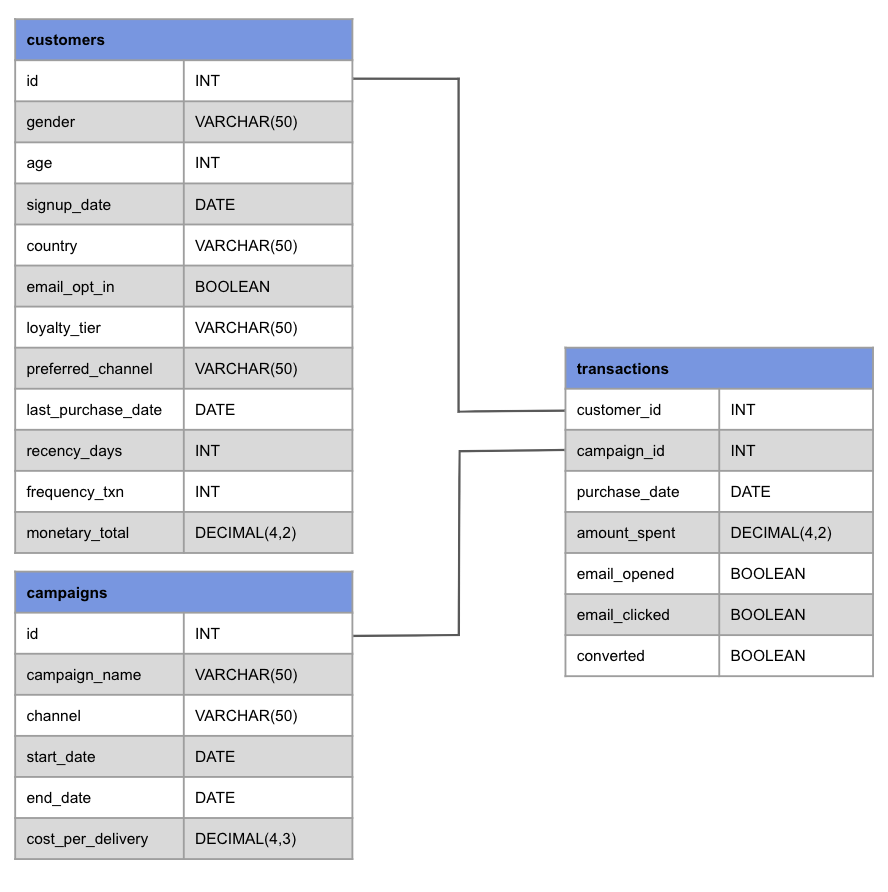
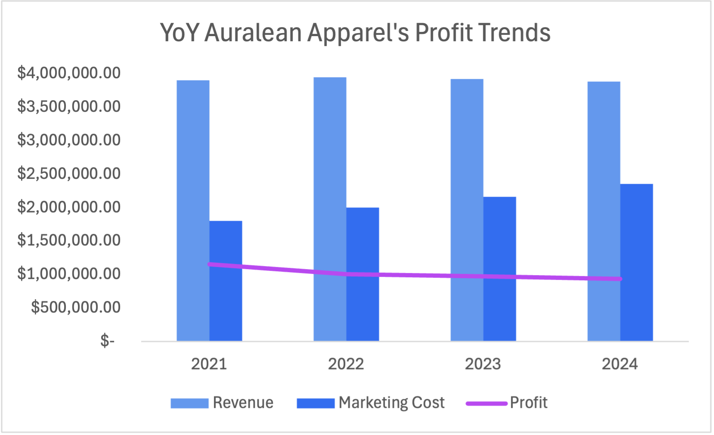
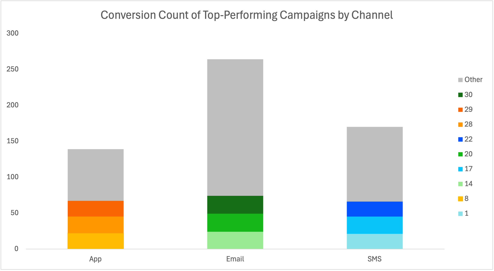
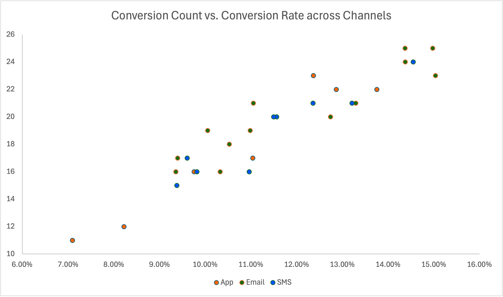
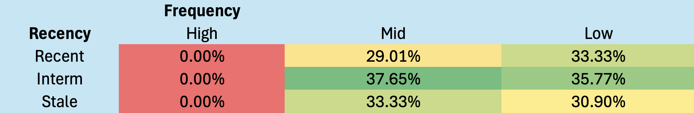
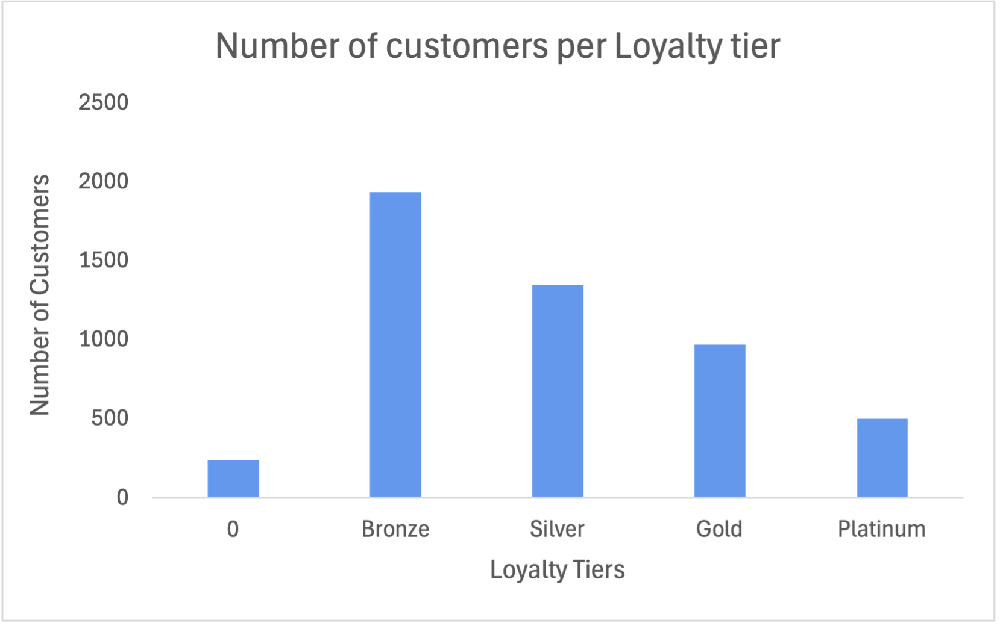
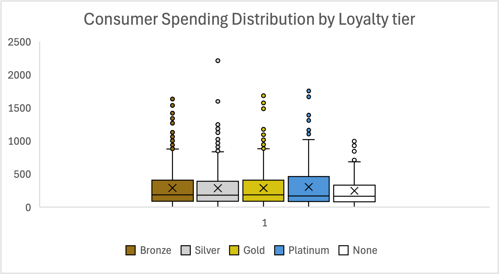

# Project Background

Auralean Apparel, founded in 2013, is a global retailer specialising in high-quality garments, accessories, and lifestyle products. Operating through both flagship stores and a dynamic e-commerce platform, Auralean Apparel has developed a loyal customer base across various regions worldwide. The brand’s marketing strategy combines seasonal campaigns and loyalty rewards to solidify its luxury positioning.

Over the years, Auralean has accumulated extensive data on customers, their purchases, and key performances of its diverse marketing campaigns. Nonetheless, much of the data’s potential has not been thoroughly utilised and investigated for analytical insights to drive strategic decisions for Auralean’s improved profitability and customer spending.

Insights and recommendations are provided on the following key areas:

- Marketing Channel Performance

  Evaluation on campaign conversion efficiency and ROI (Return on Investment) across App, Email, and SMS marketing channels, identifying top- and under-performing campaigns for targeted investment and financial optimisation.
- Customer Segmentation (RFM)

  Analysis of Recency, Frequency, and Monetary areas to determine customer profiles that generate the highest conversion count, suggesting strategies to raise customer retention, reactivation, and upselling.
- Loyalty Tier Effectiveness

  Assessment of customer spending behaviours, conversion rates, and customer base distribution across the company’s loyal tiers (Bronze, Silver, Gold, Platinum) to enhance tier benefits and encourage tier progressions.

# Data Structure & Initial Checks

Auralean's main database structure, as presented below, consists of three tables: customers, campaigns, and transactions, with a total row count of 20,030 records.

  

# Executive Summary

Following its peak in 2021, Auralean Apparel has experienced a steady decline in profit over the past three years, despite maintaining stable annual revenue of approximately $3.9 million. As illustrated in the ‘YoY Auralean’s Profit Trends’ chart below, a constant rise in yearly marketing costs—an 8.98% increase in YoY annual marketing costs on average—with a small 0.17% decrease in annual sales can be deduced as one of the most critical causes behind this profit decline.

  

To tackle this declining performance, it is crucial to analyse key metrics, particularly regarding customer engagement, such as AOV, customer retention rate, conversion rate, and ROI, and refine Auralean's existing marketing channels and campaign strategies.

# Insights Deep Dive

## 1. **Marketing Channel Performance**

  
  

- Email campaigns generated the highest conversion rate of 46.1% across all campaign channels, with top performers being Campaign ID 14 (14.37%), ID 20 (14.37%), and ID 30 (14.97%).
- Average conversion rates by channel reflect Email at 12.04%, SMS at 11.44%, and App at 10.56%.
- App campaigns record the lowest overall conversion rate (24.3% of total channel conversions), but the widespread distribution of high performers, such as Campaign ID 22 (13.75%) and low performers, such as Campaign ID 11 (7.10%), suggests unutilised potential if campaign volume is scaled.
- Each channel strength differs: Email dominates in total conversion count, App shows an efficient conversion count-to-rate ratio, and SMS campaigns have a moderate-to-high balance between conversion count and conversion rate.

## 2. **Customer Segmentation (RFM Analysis)**

  

- Based on the customers’ last purchase date and repeated purchase records in the dataset, they were distributed accordingly into three Recency (Stale, Interm, Recent) and Frequency (Low, Mid, High) segments, respectively.
- Customers in the Intermediate Recency + Mid-Frequency segment achieved the highest conversion rate, at 37.65%, indicating that strong campaign responsiveness does not necessarily correlate with a higher recent purchase frequency.
- The High-Frequency segment recorded 0.00% conversions, denoting possible campaign fatigue and limited responsiveness to additional promotions among Auralean’s most active customer base.
- Unlike prior hypotheses and expectations, the Low-Frequency segment maintained stable conversion rates across all recency groups (33.33%, 35.77%, 30.90%). This implies that the Lower-Frequency consumer segment still holds potential, especially as Auralean’s seasonal or occasional buyers who could be reactivated with targeted marketing measures.

## 3. **Loyalty Tier Effectiveness**

  
  

- 38.76% of Auralean’s customer base is Bronze-tier—the largest customer segment across all tiers (Bronze, Silver, Gold, Platinum)—followed by Silver (26.96%) and Gold (19.44%).
- 4.80% of the customers had no tier, indicating that the majority of Auralean’s customers are not solely one-time buyers—rather, they demonstrate somewhat high commitment through repeat purchases.
- The Platinum-tier customers have the highest mean spend of $272.02, but they also demonstrate high variance in purchase patterns. This reinforces plausible volatility in revenue predictability from Platinum-tier customers.
- Likewise, although Bronze-tier customers show relatively high median and mean spending, their spread is comparable to that of the Platinum tier, underscoring the need to achieve stability across Bronze- and Platinum-tier customers’ spending patterns in particular.
- Notable outlier in the Silver-tier group is observed (e.g. $2209.94), signifying a potentially less-recognised VIP customer(s) who could be candidates for upselling.

# Recommendations

Based on the insights above, we would recommend Auralean Apparel’s Finance, Sales, and Marketing Teams to consider the following points, respectively:

## Finance Team

- With the highest conversion rate (46.1%) and volume share (43.3%), the Email channel delivers the strongest ROI. **Shifting a larger share of the marketing budget toward Email campaigns and maintaining them as stable revenue drivers while reassessing underperforming App campaigns** would ensure cost efficiency.
- App has the lowest marketing cost ($0.005/unit) and competitive conversion rates in some campaigns (e.g. Campaign ID 22), indicating App campaigns’ possible high efficiency. Hence, **test-scaled investment in high-efficiency App campaigns** is recommended if ROI remains strong.
- **Redirect investment budget from low-yield High-Frequency customers** with near-zero conversions across recency segments. **Reallocate budget toward Intermediate-Recency + Mid-Frequency customer segments** with the highest observed conversion rate (37.65%).
- Focus on increasing the lifetime value of Bronze-tier customers who account for 39% of the customer base but yield lower lifetime value and high variance in purchase behaviours, by **quantifying ROI opportunity from Bronze to Silver+ upgrades, and investing in tier-upgrade initiatives** (e.g. clear loyalty advantages for higher tiers) for long-term revenue growth.
- **Build financial models to predict incremental revenue from Platinum-tier customers’ spend stabilisation and set profitability targets** before the marketing team implements retention measures to maintain Platinum customers’ high average spending ($272.05).

## Sales Team

- **Maintain high-performing Email campaigns as the primary source for immediate conversion activities**, as they show the highest conversion rate (46.1%) and campaign count (13).
- **Target under-engaged yet responsive segments** (e.g. Low-Frequency customers with >30% conversion rate) through **personalised offers, seasonal promotions, and reminder-based follow-ups** to increase overall incremental sales.
- With 46.4% of Auralean’s customer base as Silver and Gold tiers, focusing on increasing garment sales among these tier groups through **incentive-based promotions with tier upgrades** can reinforce upselling.
- **Identify Platinum-tier customers with lower spend and target their tier through promoting VIP advantages**, as they have showcased large spread in spending patterns along with Bronze-tier customers.

## Marketing Team

- **Study the top successful Email campaigns (IDs 14, 20, 30) to replicate their formats** to increase ROI from App and SMS channels.
- For App campaigns with the lowest average conversion rate (10.56%), **analyse ad impressions of the high-performing App campaigns** (IDs 8, 28, 29) to identify success drivers, improve low-performers, and raise total App campaign volume.
- **Target Intermediate-Recency and Mid-Frequency segments with personalised offers and seasonally relevant content** to increase their purchase recency and frequency while maintaining a high conversion rate (37.65%).
- Given the 0.00% observed conversion rate of the High-Frequency customer segment, **shift from acquisition-style ads to loyalty/reward programs** that incentivise the group’s consistent purchase.
- **Nudge Bronze-tier customers** (38.76% of total base) **toward subsequent tiers** by implementing milestone reward programs and exclusive benefits for higher tiers.
- As higher variance and inconsistency are highlighted by Bronze- and Platinum-tier customer spending, **tier-based marketing strategies** are recommended, particularly for the two segments.
  - For Bronze-tier: **Increase marketing strategies to push their consistency**, such as through a **punch/point card system** or **‘Buy 3 Get 20% next order coupons’**, along with **personalised tier-progress reminders** (e.g. progress bar to the next tier as Auralean’s app and website UI) for psychological incentive for increased spending.
  - For Platinum-tier: **Maintain loyalty through exclusive benefits** (e.g. **priority shipping**, **frequent discount coupons**) and UX improvements to encourage consistent purchases.

# Assumptions and Caveats

Throughout the analysis, several assumptions were made to address challenges within the dataset. The assumptions and caveats are noted below:

- **Assumption 1**: Customers with “None” tier in the data were classified as “No Tier”, as no clear evidence was available to reassign them to other specific tiers.
- **Assumption 2**: Outliers in the amount spent column below $40 were retained in the dataset without adjustment due to low magnitude significance (6 points). However, if more time and direct communication with the stakeholders are available, it may be insightful to analyse the cause of the outliers to increase high-value purchase count.
- **Assumption 3**: The observed 0.00% conversion rate in the High-Frequency customer segment may be due to a small sample size. Additional data from this segment—especially from the RFM analysis—may be required for more accurate conclusion.
